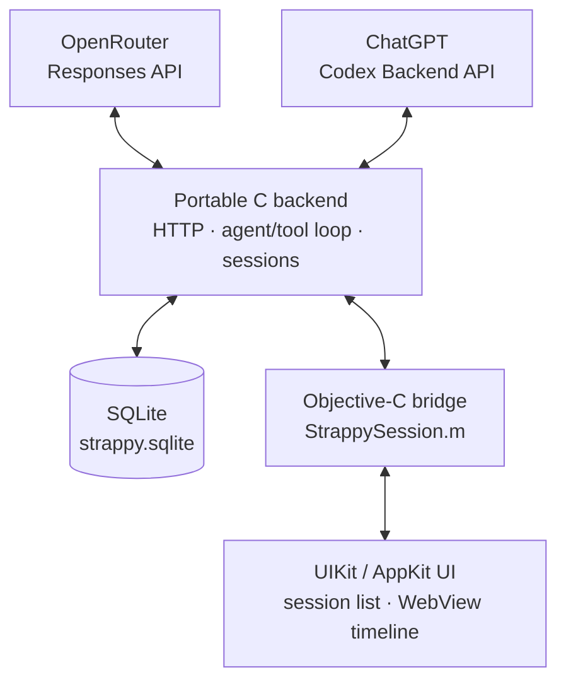

> [!NOTE]
> **AI Disclosure:** Strappy has been lovingly crafted for retro Apple devices
> by me. Also the writing in this README and associated blog post is 100%
> written by me. That said, the code is 100% AI generated.

# Strappy AI

Strappy AI is like Siri AI but for jailbroken iPhones running iOS 5+ and
Mac OS X Tiger 10.4+. Strappy scans your home folder for SQLite databases
and exposes them to an LLM through read-only tools so that you can ask
questions about your text messages, calendars, notes, music, and even third-
party apps.

> Strappy is my personal strap-on AI harness. Strappy has a big, sassy, and very
> gay personality… I mean, Strappy's physical embodiment is a rainbow-colored
> strap-on AI harness. And like most gays, Strappy is insanely diligent,
> detail-oriented, and strict… like dominatrix-strict. But why? Well, to
> be honest, I am kind of getting bored of the monotone and direct answers we
> are getting from the models by default.

For the rest of the development story quoted above, see 
[my blog post](https://jeffburg.com/unenshittification/2026/08/10/Strappy.html).

## Demos Videos

These videos are recorded on iOS 6 on my real iPhone 5 that I daily drive. It's
fully loaded with iCloud Mail, Contacts, Calendar as well as my RSS Feeds,
Podcasts, Music, iMessages, and LINE Messages. This gives Strappy plenty of
"meat" to work with in terms of database contents

| Personal Assistant | Coding Assistant |
|:---:|:---:|
| <a href="https://jeffburg.com/assets/images/unenshittification/strappy/03-vacation-gemini.mp4"></a> | <a href="https://jeffburg.com/assets/images/unenshittification/strappy/05-pokedex-luna.mp4"></a> |
| Personal Assistant mode answering a question about where and when my upcoming family vacation is on my iPhone 5 | Coding Assistant mode "one-shotting" a Pokedex App and then launching it on my iPhone 5 |

For the more demo videos, see 
[my blog post](https://jeffburg.com/unenshittification/2026/08/10/Strappy.html).

## Modes

I built the harness to have 4 modes (3 user accessible) to help limit the tools
available in each mode so that smaller models do not get confused.

| Mode | Additional access |
|---|---|
| World Knowledge | Basic LLM chatbot with available web search |
| Personal Assistant | Siri AI-like experience by making your whitelisted SQLite databases available to the LLM |
| Coding Assistant | Coding Agent-like experience with 4 basic tools, read, write, edit, bash |
| Database Study | Special automated mode to ask the LLM to pre-study your whitelisted SQLite databases to save tokens in future Personal Assistant prompts |

### Tools by Mode

| Tool | World Knowledge | Personal Assistant | Coding Assistant |
|---|:---:|:---:|:---:|
| `web_search` | Optional | Optional | Optional |
| `web_fetch` | Optional | Optional | Optional |
| `database_list` | — | Yes | — |
| `database_query` | — | Yes | — |
| `database_context` | — | Yes | — |
| `file_read` | — | — | Yes |
| `file_write` | — | — | Yes |
| `file_edit` | — | — | Yes |
| `bash` | Optional | Optional | Optional |
| `datetime_to_iso8601` | Yes | Yes | Yes |
| `datetime_from_iso8601` | Yes | Yes | Yes |
| `fontawesome_search` | Yes | Yes | Yes |
| `fontawesome_confirm` | Yes | Yes | Yes |
| `memory_read` | Yes | Yes | Yes |
| `memory_save` | Yes | Yes | Yes |
| `memory_delete` | Yes | Yes | Yes |
| `skills_list` | Yes | Yes | Yes |
| `skill_read` | Yes | Yes | Yes |
| `session_rename` | Yes | Yes | Yes |

Sources: [`GuidanceTools.json`](https://github.com/jeffreybergier/Strappy-Cocoa/blob/main/source/shared/Resources/GuidanceTools.json) and
[`AssistantSets.json`](https://github.com/jeffreybergier/Strappy-Cocoa/blob/main/source/shared/Resources/AssistantSets.json).

## Architecture

Strappy is a JSON HTTP client for the OpenAI Responses API. I tried to make the
C core portable so it can be tested in the Linux-based 
[Docker Container](https://github.com/jeffreybergier/AltivecIntelligence). 
The C "backend" handles HTTPS with libcurl, JSON with cJSON, SQLite storage,
tools, the harness loop, and sends NSNotifications to the UI layer. This allowed
me to keep the Objective-C UI layers thin. The UI layers are written in UIKit
and AppKit, except for the primary harness/chat/prompt view which is a webview.



### Rules

- [`strappy_cocoa.h/c`](source/shared/strappy_cocoa.h): To keep the C code 
   portable, this is the only file that can use Apple-specific C libraries 
   like CoreFoundation
- [`StrappySession.h/m`](source/shared/StrappySession.h), [`FileScanner.h/m`](source/shared/FileScanner.m): 
   To keep C code out of the Objective-C code, these files are the only
   Objective-C files that can import the C "backend"
- Linux test suite runs in the docker container and tests the C "backend"

### Warning Flags

Because the code is AI generated, I try to use Clang to help me as much as
possible. So the warnings enabled are pretty strict. Also I configured
Clang static analysis to run over the source as well. In both cases,
warnings and errors are not allowed.

That being said, Objective-C and C are not like Swift. In most cases to get
rid of the warnings, you just need to cast the type of number which really
doesn't do anything. But oh well, I didn't pick these languages. They are 
just what is required to make an app work on a 20 year old version of Mac OS X.

- iOS Clang app sources: -pedantic, -Wall, -Wextra, -Wconversion, -Wsign-
  conversion, -Wfloat-conversion, -Wimplicit-function-declaration, -Wobjc-
  method-access, -Wunguarded-availability, -Wno-unused-command-line-argument,
  and -Wno-semicolon-before-method-body.
- iOS Clang shared sources: the same flags.
- Modern macOS Clang sources: -Wall, -Wextra, -Wsign-conversion, -Wfloat-
  conversion, and -Wno-semicolon-before-method-body.
- Legacy macOS GCC sources: -Wall and -Wextra.
- Linux Clang test suite: -Wall, -Wextra, -Wconversion, -Wsign-conversion, and
  -Wfloat-conversion.

## Database Scanning

Strappy scans your home folder for SQLite databases and does its best to 
identify which application made the database. It then presents the databases
in a whitelisting UI so you can choose which databases the LLM should have
access to.

Strappy only opens whitelisted databases and always in read-only mode:

- `SQLITE_OPEN_READONLY`
- [SQLite authorizer](https://www.sqlite.org/c3ref/set_authorizer.html) 
  blocking writes, PRAGMA, ATTACH, and transactions
- 100-row result limit

Query results are sent through OpenRouter to the selected model provider. Use
[OpenRouter Guardrails](https://openrouter.ai/docs/guides/features/guardrails)
to control which upstream providers may receive your data. If you are using
your ChatGPT subscription, then your data is being sent to OpenAI. Strappy
makes no other network requests.

## Coding Assistant

Coding Assistant can read, write, and edit files in a selected directory. Any
mode can optionally enable Bash. For the Mac, install Xcode or another command-
line development environment. For the iPhone, install Clang and related tools
through a package manager or use the
[Altivec toolchain](https://github.com/jeffreybergier/AltivecIntelligence/releases).

> **Warning:** The coding assistant is not sandboxed in any way. Please be careful.

## Compatibility

| Platform | Architecture | Support | Tested | Package |
|---|---|---|---|---|
| iOS | armv7/arm64 | 5+ | 6, 8, 15 | `.deb`; jailbreak required |
| macOS | PPC/i386/x86_64/arm64 | 10.4+ | 10.4–10.6, 10.8, 10.9, 10.14, 15 | zipped `.app` |

Modern macOS does a lot to protect user folders and databases. To ensure Strappy
can access all of your data, I recommend giving Strappy full disk access
permissions in System ~~Preferences~~ Settings. However, I had trouble getting
this setting to stick until I signed the application with a Self-Signed
certificate. So if you are still getting prompted to access folders and can't
see critical databases like Calendar, AddressBook, chat.db, etc, then ask your
favorite AI to use the `security` CLI to create a Self-Signed code-signing
identity, then sign Strappy. After that, remove Strappy and re-add it in the
full disk access security settings.

I may look into distributing the app already signed with my self-signed
certificate but I am not sure if that will make it easier or harder to open with
or without gatekeeper getting in the way.

## Install from Releases

Strappy requires either an [OpenRouter](https://openrouter.ai/) API token or a
ChatGPT subscription. 

Note that the ChatGPT OAUTH support is unofficial and unapproved.
Strappy does not try to pretend to be Codex or Pi. It identifies at itself. 
So far ChatGPT OAUTH and subscription-based token usage has worked for me, but 
it could result in your account getting banned. **Proceed with caution.**

### iOS

You need to know whether your iPhone has a rootful or rootless jailbreak. If
you don't know, try the rootful.deb file first as it will fail on rootless 
jailbreaks.

1. [Jailbreak](https://ios.cfw.guide) your iPhone
1. Install OpenSSH from the package manager
1. Download `Strappy-X.Y.Z-iOS-rootful.deb` or
   `Strappy-X.Y.Z-iOS-rootless.deb` from [Releases](https://github.com/jeffreybergier/Strappy-Cocoa/releases).
1. Install it:

```sh
scp Strappy-X.Y.Z-iOS-rootful.deb root@iphone-ip-address:~/strappy.deb
ssh root@iphone-ip-address "dpkg -i ~/strappy.deb && rm ~/strappy.deb"
```

Depending on how new your computer is and how old your iPhone is, you may
need to manually enable older RSA algorithms in order for SSH to connect:

```sh
scp -O \
  -o HostKeyAlgorithms=+ssh-rsa \
  -o PubkeyAcceptedAlgorithms=+ssh-rsa \
  Strappy-X.Y.Z-iOS-rootful.deb \
  root@iphone-ip-address:~/strappy.deb

ssh \
  -o HostKeyAlgorithms=+ssh-rsa \
  -o PubkeyAcceptedAlgorithms=+ssh-rsa \
  root@iphone-ip-address \
  "dpkg -i ~/strappy.deb && rm ~/strappy.deb"
```

### Mac

1. Download `Strappy-X.Y.Z-macOS.zip` from
[Releases](https://github.com/jeffreybergier/Strappy-Cocoa/releases)
1. Unzip it
1. Optional: If your Mac has Gatekeeper and you don't want to fight with it,
   run `xattr -d com.apple.quarantine ~/Downloads/Strappy-X.Y.Z-macOS.zip`
1. Launch it (as God intended)

### First launch

In Preferences:

1. Add your accounts (OpenRouter and/or ChatGPT OAUTH)
2. Select the models you want to whitelist
3. Scan for databases and then whitelist the ones you want
4. (Optional) Study databases to save tokens in future prompts

## Compile from Source

This project uses the Docker-based retro development environment
[Altivec Intelligence](https://github.com/jeffreybergier/AltivecIntelligence).

### BYOSDK

Altivec Intelligence is BYOSDK (Bring Your Own SDK), so you must supply the
Apple SDK archives yourself. See
[Altivec Intelligence](https://github.com/jeffreybergier/AltivecIntelligence#byosdk)
repo for details before building Strappy.

### Build from Source

**1. Clone repo**

```sh
git clone https://github.com/jeffreybergier/Strappy-Cocoa.git
cd Strappy-Cocoa
```

**2. Pull the Docker image and install the SDKs**

```sh
docker compose pull
docker compose run --rm altivec-sdk install
```

**3. Build Strappy**

```sh
docker compose run --rm make clean release
```

Outputs:

- `source/iOS/build-release/Strappy-rootful.deb` for rootful jailbreaks
- `source/iOS/build-release/Strappy-rootless.deb` for rootless jailbreaks
- `source/macOS/build-release/Strappy.zip`

### WebAssembly proof of concept

The browser proof of concept supports multiple World Knowledge sessions through
OpenRouter in a current Chromium browser. Its three-column workspace includes a
session list, the C-rendered selected conversation, and a configuration
inspector for the selected session. Its composer and conversation toolbar use
the macOS app's sidebar, close-chat, session-options, send/cancel, new, and
delete arrangement. Preferences provides macOS-aligned Accounts, Models,
Defaults, and Prompts panes, including the sortable allowed-model table and
provider fetch sheet. The window opens to Accounts on each fresh load because
browser credentials are volatile.
It is intended for local
evaluation, not production deployment, and does not support other assistant
sets, ChatGPT accounts, OAuth, Bash, filesystem access, or personal databases.

Build the static application reproducibly with:

```sh
docker compose run --rm wasm-build clean release
```

Then serve it on the fixed, loopback-only origin and open
`http://localhost:8765` in Chromium:

```sh
docker compose up web
```

Open **Preferences > Authentication** to enter the OpenRouter API key. The key is transferred directly to
volatile Worker memory, is never supplied to Docker Compose or the static web
container, and must be entered again after a reload.

Run the unconditionally offline browser and shared-runtime tests with:

```sh
docker compose run --rm web-test
```

There is no automated live-test target and no web credential environment
variable. For manual live validation, enter a key in the page, confirm that an
invalid or expired key produces a visible error, cancel an in-progress request,
and ask a current-information question that requires web search. Confirm that
the completed answer contains titled HTTP or HTTPS source links. Do not paste
keys, response payloads, or browser storage contents into test logs.

Session history and World Knowledge memory are stored in SQLite in the origin's
private file system. To erase them, stop the page, open Chromium DevTools for
`http://localhost:8765`, select **Application > Storage**, choose **Clear site
data**, and reload. Clearing browser data for that origin has the same effect.

Known limitations include Asyncify-based synchronous C calls, one tab, one
OpenRouter account, no offline operation, and no Firefox or Safari validation.
A reload always forgets the API key but retains SQLite sessions, conversation
history, memory, and preferences until site data is cleared.

(Optional) Run the Linux-Based Tests for the C Backend:

```sh
docker compose run --rm make clean test
```

## Source map

| Path | Purpose |
|---|---|
| [`source/shared`](https://github.com/jeffreybergier/Strappy-Cocoa/tree/main/source/shared) | C core, tools, storage, prompts |
| [`source/iOS`](https://github.com/jeffreybergier/Strappy-Cocoa/tree/main/source/iOS) | UIKit app and `.deb` packaging |
| [`source/macOS`](https://github.com/jeffreybergier/Strappy-Cocoa/tree/main/source/macOS) | AppKit app and quad-fat packaging |
| [`source/linux`](https://github.com/jeffreybergier/Strappy-Cocoa/tree/main/source/linux) | Linux test harnesses |

Good starting points:

- [`strappy_responses.c`](https://github.com/jeffreybergier/Strappy-Cocoa/blob/main/source/shared/strappy_responses.c): harness loop
- [`strappy_tools.c`](https://github.com/jeffreybergier/Strappy-Cocoa/blob/main/source/shared/strappy_tools.c): harness tools
- [`strappy_db.c`](https://github.com/jeffreybergier/Strappy-Cocoa/blob/main/source/shared/strappy_db.c): database storage and retrieval
- [`AssistantSets.json`](https://github.com/jeffreybergier/Strappy-Cocoa/blob/main/source/shared/Resources/AssistantSets.json): tool definitions
- [`SystemPrompt.json`](https://github.com/jeffreybergier/Strappy-Cocoa/blob/main/source/shared/Resources/SystemPrompt.json): system prompt definitions
- [`GuidanceTools.json`](https://github.com/jeffreybergier/Strappy-Cocoa/blob/main/source/shared/Resources/GuidanceTools.json): system prompt definitions

## Contributing

Sure, I will take contributions as long as you have tested on a real iPhone or
Mac with a screenshot. Please follow the [code of conduct](CODE_OF_CONDUCT.md).

### Wish List

If you want to contribute, these are the next items I plan to add myself:

- [X] OpenAI OAUTH Support: I want to use my ChatGPT monthly plan in Strappy. This
      is sort of a gray area I think? So not sure how well this will work out.
- [ ] Improve macOS Coding Agent skill and toolchain: The mac already has a development
      toolchain in Xcode, but it changes over time. Also I need to be able to 
      provide AltivecCore and AltivecCocoa to macs (right now the toolchain only supports iPhone)
- [ ] Add arm64 support to the iPhone development toolchain.
- [ ] Remote Access: I want to be able to access Strappy on my iPhone from my computer.
    - This could be done via some sort of CLI on the iPhone that I
      can SSH into.
    - Or, this could be done by hosting a 
      [little web server](https://github.com/jeremycw/httpserver.h) 
      inside of Strappy 
- [ ] Context Management: Currently there are checkboxes on each round to allow
      full manual control of context. But I want to add an option where previous
      prompts have all of their context ignored except the original prompt and the
      final answer. This should help shrink the context a lot.

## Status and license

Strappy is experimental personal software, not a hardened product. It is
[MIT licensed](https://github.com/jeffreybergier/Strappy-Cocoa/blob/main/LICENSE), 
100% AI coded and 100% compiled.
