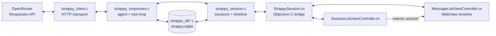

> [!NOTE]
> AI Disclosure:
> Strappy has been lovingly crafted by me. Also the writing in this README
> and in the blog post is 100% written by me. That said, the code is 100%
> AI generated. I would not recommend reading it; Its like 40,000+ lines of
> boilerplate JSON parsing and database storage and retrieval code written in
> C99.

# Strappy AI

Strappy AI is like Siri AI but for jailbroken iPhones running iOS 5+ and
Mac OS X Tiger 10.4+. Strappy scans your home folder for SQLite databases
and exposes them to an LLM through read-only tools so that you can ask
questions about your text messages, calendars, notes, music, and even third-
party apps.

Strappy is my personal strap-on AI harness. Strappy has a big, sassy, and very
gay personality… I mean, Strappy's physical embodiment is a 12" strap-on
rainbow eggplant. And like most gays, Strappy is insanely diligent,
detail-oriented, and strict… like dominatrix-strict. But why? Well, to
be honest, I am kind of getting bored of the monotone and direct answers we
are getting from the models by default.

For the development story and more demos, read
[my blog post](https://jeffburg.com/unenshittification/2026/08/10/Strappy.html).

## Demos

These videos are recorded on iOS 6 on my real iPhone 5 that I daily drive. It's
fully loaded with iCloud Mail, Contacts, Calendar as well as my RSS Feeds,
Podcasts, Music, iMessages, and LINE Messages. This gives Strappy plenty of
"meat" to work with in terms of database contents

| Personal Assistant | Coding Assistant |
|:---:|:---:|
| <a href="https://raw.githubusercontent.com/jeffreybergier/jeffreybergier.github.io/main/source/assets/images/unenshittification/strappy/03-vacation-gemini.mp4"></a> | <a href="https://raw.githubusercontent.com/jeffreybergier/jeffreybergier.github.io/main/source/assets/images/unenshittification/strappy/05-pokedex-luna.mp4"></a> |
| Personal assistant activates the database tools so the LLM can run SQL queries on your databases to answer your question | Coding Assistant enables development tools so that Strappy can write, compile, install, and run new apps directly on your iPhone. |

## Modes

| Mode | Additional access |
|---|---|
| World Knowledge | General knowledge |
| Personal Assistant | Approved SQLite databases |
| Coding Assistant | Files and coding skills |

Every mode includes memory and utility tools. Web access and Bash are optional 
and available in any mode.

### Tools by Mode

| Tool | World Knowledge | Personal Assistant | Coding Assistant |
|---|:---:|:---:|:---:|
| `web_search` | Optional | Optional | Optional |
| `web_fetch` | Optional | Optional | Optional |
| `database_list` | — | Yes | — |
| `database_query` | — | Yes | — |
| `database_context` | — | Yes | — |
| `file_read` | — | — | Yes |
| `file_write` | — | — | Yes |
| `file_edit` | — | — | Yes |
| `bash` | Optional | Optional | Optional |
| `datetime_to_iso8601` | Yes | Yes | Yes |
| `datetime_from_iso8601` | Yes | Yes | Yes |
| `fontawesome_search` | Yes | Yes | Yes |
| `fontawesome_confirm` | Yes | Yes | Yes |
| `memory_read` | Yes | Yes | Yes |
| `memory_save` | Yes | Yes | Yes |
| `memory_delete` | Yes | Yes | Yes |
| `skills_list` | Yes | Yes | Yes |
| `skill_read` | Yes | Yes | Yes |
| `session_rename` | Yes | Yes | Yes |

Sources: [`GuidanceTools.json`](source/shared/Resources/GuidanceTools.json) and
[`AssistantSets.json`](source/shared/Resources/AssistantSets.json).

## Architecture

Strappy is a JSON HTTP client for the OpenAI Responses API. Its portable C core
handles HTTPS with libcurl, JSON with cJSON, SQLite storage, tools, and session
behavior. Thin Objective-C layers provide native UIKit and AppKit interfaces.
The session timeline is rendered as HTML by C and displayed in a web view.



### Rules

- `strappy_cocoa.c`: To keep the C code portable, this is the only file that 
   can use Apple-specific C libraries like CoreFoundation
- `StrappySession.m`, `FileScanner.m`: To keep C code out of the Objective-C 
   code, these files are the only Objective-C files that can import the C "backend"
- Linux test suite runs in the docker container and tests the C "backend"

### Warning Flags

Compiler errors and warnings are not allowed. Clang Static Analysis must also
produce zero warnings.

The project Makefiles and imported Altivec build engine configure these
warning and diagnostic flags:

- iOS app sources: `-pedantic`, `-Wall`, `-Wextra`, `-Wconversion`,
  `-Wsign-conversion`, `-Wfloat-conversion`,
  `-Wimplicit-function-declaration`, `-Wobjc-method-access`,
  `-Wunguarded-availability`, `-Wno-unused-command-line-argument`, and
  `-Wno-semicolon-before-method-body`.
- Shared iOS backend sources add: `-Wno-conversion`,
  `-Wno-sign-conversion`, `-Wno-float-conversion`,
  `-Wno-strict-prototypes`, and `-Wno-newline-eof`.
- macOS sources: `-Wall`, `-Wextra`, `-Wsign-conversion`,
  `-Wfloat-conversion`, `-Wno-semicolon-before-method-body`,
  `-Wno-conversion`, `-Wno-sign-conversion`, `-Wno-float-conversion`,
  `-Wno-strict-prototypes`, and `-Wno-newline-eof`.
- Linux shared-core harnesses: `-Wall`, `-Wextra`, `-Wconversion`,
  `-Wsign-conversion`, and `-Wfloat-conversion`.

Where both forms appear, the later `-Wno-*` compatibility flag takes
precedence over the corresponding enabled warning.

The Apple `analyze` targets run Clang with `--analyze`, `-Xanalyzer`, and
`-analyzer-output=text`, using the same target-specific warning flags above.

## Database Scanning

Strappy scans your home folder for SQLite databases and does its best to 
identify which application made the database. It then presents the databases
in a whitelisting UI so you can choose which databases the LLM should have
access to.

Protections are always enabled:

- Explicit database whitelist
- `SQLITE_OPEN_READONLY`
- SQLite authorizer blocking writes, PRAGMA, ATTACH, and transactions
- 100-row result limit

Query results are sent through OpenRouter to the selected model provider. Use
[OpenRouter Guardrails](https://openrouter.ai/docs/guides/features/guardrails)
to control which providers may receive your data.

## Coding Assistant

Coding Assistant can read, write, and edit files in a selected directory. Any
mode can optionally enable Bash. For the Mac, install Xcode or another command-
line development environment. For the iPhone, install Clang and related tools
through a package manager or use the
[Altivec toolchain](https://github.com/jeffreybergier/AltivecIntelligence/releases).

> **Warning:** Bash is not sandboxed, so use it with caution.

## Compatibility

| Platform | Architecture | Support | Tested | Package |
|---|---|---|---|---|
| iOS | armv7/arm64 | 5+ | 6, 8, 15 | `.deb`; jailbreak required |
| macOS | PPC/i386/x86_64/arm64 | 10.4+ | 10.4–10.6, 10.8, 10.9, 10.14, 15 | zipped `.app` |

The Mac build is one quad-fat binary. Older Mac apps often predate SQLite, and
newer macOS versions restrict access to some personal data. Personal Assistant
may therefore find less useful data on a Mac.

## Install

Requires an [OpenRouter](https://openrouter.ai/) API token.

### iOS

1. Jailbreak the device and enable SSH.
1. Download `Strappy-X.Y.Z-iOS.deb` from
   [Releases](https://github.com/jeffreybergier/Strappy-Cocoa/releases).
1. Install it:

```sh
scp Strappy-X.Y.Z-iOS.deb root@iphone-ip-address:~/strappy.deb
ssh root@iphone-ip-address "dpkg -i ~/strappy.deb && rm ~/strappy.deb"
```

Older SSH servers may require RSA compatibility options:

```sh
scp -O \
  -o HostKeyAlgorithms=+ssh-rsa \
  -o PubkeyAcceptedAlgorithms=+ssh-rsa \
  Strappy-X.Y.Z-iOS.deb \
  root@iphone-ip-address:~/strappy.deb

ssh \
  -o HostKeyAlgorithms=+ssh-rsa \
  -o PubkeyAcceptedAlgorithms=+ssh-rsa \
  root@iphone-ip-address \
  "dpkg -i ~/strappy.deb && rm ~/strappy.deb"
```

### Mac

1. Download `Strappy-X.Y.Z-macOS.zip` from
[Releases](https://github.com/jeffreybergier/Strappy-Cocoa/releases)
1. Unzip it and launch it (as God intended)

### First launch

In Preferences:

1. Save your OpenRouter token in keychain.
2. Select the models you want to whitelist
3. Scan for databases and then whitelist the ones you want
4. (Optional) Study databases to save tokens in future prompts

## Compile from Source

The project uses the my Docker-based retro development environment called
[Altivec Intelligence](https://github.com/jeffreybergier/AltivecIntelligence)

```sh
git clone https://github.com/jeffreybergier/Strappy-Cocoa.git
cd Strappy-Cocoa
docker compose pull
docker compose run --rm make clean release
```

Outputs:

- `source/iOS/build-release/Strappy.deb`
- `source/macOS/build-release/Strappy.zip`

### Deploy over SSH

The Altivec container reads SSH configuration and keys from
`~/.altivec/.ssh` on the host. After configuring key-based SSH access, deploy
the macOS build to a remote Mac with:

```sh
docker compose run --rm altivec \
  "altivec-deploy source/macOS/build-release -d user@mac-host"
```

Replace `user@mac-host` with the remote Mac's SSH user and address. The command
runs a preflight, shows what it will transfer, and asks for confirmation before
uploading and launching Strappy. Add `--yes` for a non-interactive deployment.

`altivec-deploy` currently requires an `.ipa` for iOS deployment. Strappy is
distributed as a privileged `.deb`, so install its iOS build using the
[SSH instructions above](#ios).

(Optional) Run the Linux-Based Tests for the C Backend:

```sh
docker compose run --rm make clean test
```

## Source map

| Path | Purpose |
|---|---|
| `source/shared` | C core, tools, storage, prompts |
| `source/iOS` | UIKit app and `.deb` packaging |
| `source/macOS` | AppKit app and quad-fat packaging |
| `source/linux` | Portable C test harnesses |

Good starting points:

- [`strappy_responses.c`](source/shared/strappy_responses.c): agent loop
- [`strappy_tools.c`](source/shared/strappy_tools.c): tool validation and dispatch
- [`strappy_db.c`](source/shared/strappy_db.c): normalized SQLite storage
- [`AssistantSets.json`](source/shared/Resources/AssistantSets.json): modes and tool allowlists
- [`SystemPrompt.json`](source/shared/Resources/SystemPrompt.json): prompt structure

## Status and license

Strappy is experimental personal software, not a hardened product. It is
[MIT licensed](LICENSE), 99% vibe-coded, and 100% compiled.
