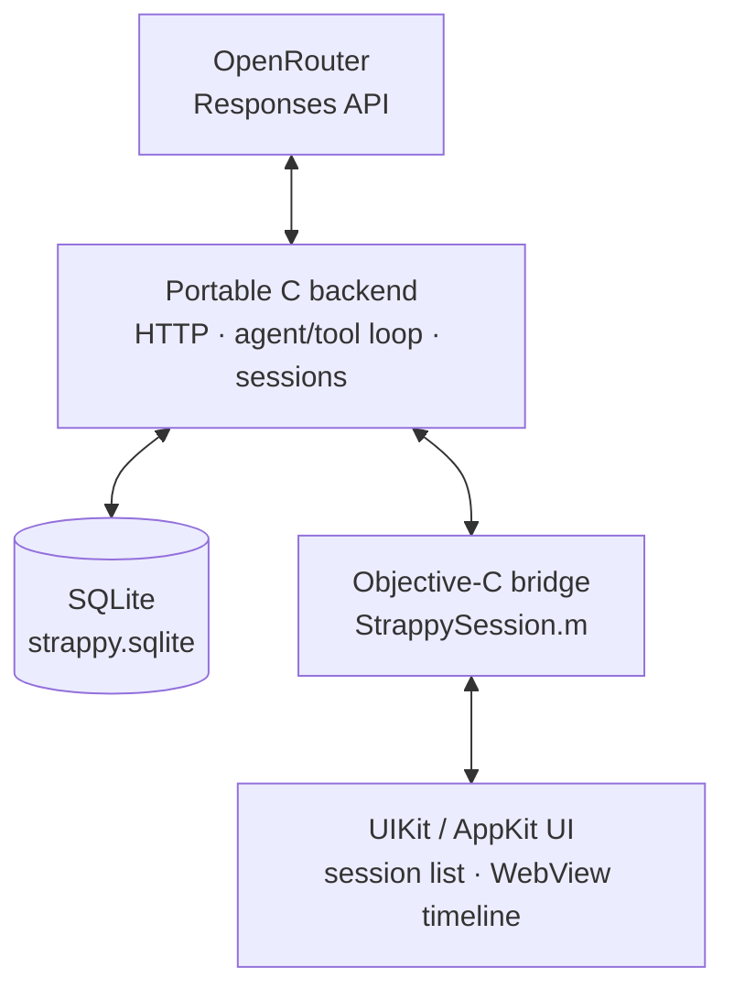

> [!NOTE]
> **AI Disclosure:** Strappy has been lovingly crafted for retro Apple devices
> by me. Also the writing in this README and associated blog post is 100%
> written by me. That said, the code is 100% AI generated.

# Strappy AI

Strappy AI is like Siri AI but for jailbroken iPhones running iOS 5+ and
Mac OS X Tiger 10.4+. Strappy scans your home folder for SQLite databases
and exposes them to an LLM through read-only tools so that you can ask
questions about your text messages, calendars, notes, music, and even third-
party apps.

> Strappy is my personal strap-on AI harness. Strappy has a big, sassy, and very
> gay personality… I mean, Strappy's physical embodiment is a 12" strap-on
> rainbow eggplant. And like most gays, Strappy is insanely diligent,
> detail-oriented, and strict… like dominatrix-strict. But why? Well, to
> be honest, I am kind of getting bored of the monotone and direct answers we
> are getting from the models by default.

For the rest of the development story quoted above, see 
[my blog post](https://jeffburg.com/unenshittification/2026/08/10/Strappy.html).

## Demos Videos

These videos are recorded on iOS 6 on my real iPhone 5 that I daily drive. It's
fully loaded with iCloud Mail, Contacts, Calendar as well as my RSS Feeds,
Podcasts, Music, iMessages, and LINE Messages. This gives Strappy plenty of
"meat" to work with in terms of database contents

| Personal Assistant | Coding Assistant |
|:---:|:---:|
| <a href="https://jeffburg.com/assets/images/unenshittification/strappy/03-vacation-gemini.mp4"></a> | <a href="https://jeffburg.com/assets/images/unenshittification/strappy/05-pokedex-luna.mp4"></a> |
| Personal Assistant mode answering a question about where and when my upcoming family vacation is on my iPhone 5 | Coding Assistant mode "one-shotting" a Pokedex App and then launching it on my iPhone 5 |

For the more demo videos, see 
[my blog post](https://jeffburg.com/unenshittification/2026/08/10/Strappy.html).

## Modes

I built the harness to have 4 modes (3 user accessible) to help limit the tools
available in each mode so that smaller models do not get confused.

| Mode | Additional access |
|---|---|
| World Knowledge | Basic LLM chatbot with available web search |
| Personal Assistant | Siri AI-like experience by making your whitelisted SQLite databases available to the LLM |
| Coding Assistant | Coding Agent-like experience with 4 basic tools, read, write, edit, bash |
| Database Study | Special automated mode to ask the LLM to pre-study your whitelisted SQLite databases to save tokens in future Personal Assistant prompts |

### Tools by Mode

| Tool | World Knowledge | Personal Assistant | Coding Assistant |
|---|:---:|:---:|:---:|
| `web_search` | Optional | Optional | Optional |
| `web_fetch` | Optional | Optional | Optional |
| `database_list` | — | Yes | — |
| `database_query` | — | Yes | — |
| `database_context` | — | Yes | — |
| `file_read` | — | — | Yes |
| `file_write` | — | — | Yes |
| `file_edit` | — | — | Yes |
| `bash` | Optional | Optional | Optional |
| `datetime_to_iso8601` | Yes | Yes | Yes |
| `datetime_from_iso8601` | Yes | Yes | Yes |
| `fontawesome_search` | Yes | Yes | Yes |
| `fontawesome_confirm` | Yes | Yes | Yes |
| `memory_read` | Yes | Yes | Yes |
| `memory_save` | Yes | Yes | Yes |
| `memory_delete` | Yes | Yes | Yes |
| `skills_list` | Yes | Yes | Yes |
| `skill_read` | Yes | Yes | Yes |
| `session_rename` | Yes | Yes | Yes |

Sources: [`GuidanceTools.json`](https://github.com/jeffreybergier/Strappy-Cocoa/blob/main/source/shared/Resources/GuidanceTools.json) and
[`AssistantSets.json`](https://github.com/jeffreybergier/Strappy-Cocoa/blob/main/source/shared/Resources/AssistantSets.json).

## Architecture

Strappy is a JSON HTTP client for the OpenAI Responses API. I tried to make the
C core portable so it can be tested in the Linux-based 
[Docker Container](https://github.com/jeffreybergier/AltivecIntelligence). 
The C "backend" handles HTTPS with libcurl, JSON with cJSON, SQLite storage,
tools, the harness loop, and sends NSNotifications to the UI layer. This allowed
me to keep the Objective-C UI layers thin. The UI layers are written in UIKit
and AppKit, except for the primary harness/chat/prompt view which is a webview.



### Rules

- [`strappy_cocoa.h/c`](source/shared/strappy_cocoa.h): To keep the C code 
   portable, this is the only file that can use Apple-specific C libraries 
   like CoreFoundation
- [`StrappySession.h/m`](source/shared/StrappySession.h), [`FileScanner.h/m`](source/shared/FileScanner.m): 
   To keep C code out of the Objective-C code, these files are the only
   Objective-C files that can import the C "backend"
- Linux test suite runs in the docker container and tests the C "backend"

### Warning Flags

Because the code is AI generated, I try to use Clang to help me as much as
possible. So the warnings enabled are pretty strict. Also I configured
Clang static analysis to run over the source as well. In both cases,
warnings and errors are not allowed.

That being said, Objective-C and C are not like Swift. In most cases to get
rid of the warnings, you just need to cast the type of number which really
doesn't do anything. But oh well, I didn't pick these languages. They are 
just what is required to make an app work on a 20 year old version of Mac OS X.

- iOS Clang app sources: -pedantic, -Wall, -Wextra, -Wconversion, -Wsign-
  conversion, -Wfloat-conversion, -Wimplicit-function-declaration, -Wobjc-
  method-access, -Wunguarded-availability, -Wno-unused-command-line-argument,
  and -Wno-semicolon-before-method-body.
- iOS Clang shared sources: the same flags, plus -Wno-conversion, -Wno-sign-
  conversion, -Wno-float-conversion, -Wno-strict-prototypes, and -Wno-newline-
  eof.
- Modern macOS Clang sources: -Wall, -Wextra, -Wsign-conversion, -Wfloat-
  conversion, -Wno-semicolon-before-method-body, -Wno-conversion, -Wno-sign-
  conversion, -Wno-float-conversion, -Wno-strict-prototypes, and -Wno-newline-
  eof.
- Legacy macOS GCC sources: -Wall and -Wextra.
- Linux Clang test suite: -Wall, -Wextra, -Wconversion, -Wsign-conversion, and
  -Wfloat-conversion.

## Database Scanning

Strappy scans your home folder for SQLite databases and does its best to 
identify which application made the database. It then presents the databases
in a whitelisting UI so you can choose which databases the LLM should have
access to.

Strappy only opens whitelisted databases and always in read-only mode:

- `SQLITE_OPEN_READONLY`
- [SQLite authorizer](https://www.sqlite.org/c3ref/set_authorizer.html) 
  blocking writes, PRAGMA, ATTACH, and transactions
- 100-row result limit

Query results are sent through OpenRouter to the selected model provider. Use
[OpenRouter Guardrails](https://openrouter.ai/docs/guides/features/guardrails)
to control which providers may receive your data.

## Coding Assistant

Coding Assistant can read, write, and edit files in a selected directory. Any
mode can optionally enable Bash. For the Mac, install Xcode or another command-
line development environment. For the iPhone, install Clang and related tools
through a package manager or use the
[Altivec toolchain](https://github.com/jeffreybergier/AltivecIntelligence/releases).

> **Warning:** The coding assistant is not sandboxed in any way. Please be careful.

## Compatibility

| Platform | Architecture | Support | Tested | Package |
|---|---|---|---|---|
| iOS | armv7/arm64 | 5+ | 6, 8, 15 | `.deb`; jailbreak required |
| macOS | PPC/i386/x86_64/arm64 | 10.4+ | 10.4–10.6, 10.8, 10.9, 10.14, 15 | zipped `.app` |

The Mac build is one quad-fat binary. Older Mac apps often don't use SQLite
databases, and newer macOS versions restrict access to some personal data.
Personal Assistant may therefore find less useful data on a Mac.

## Install

Requires an [OpenRouter](https://openrouter.ai/) API token.

### iOS

1. [Jailbreak](https://ios.cfw.guide) your iPhone
1. Install OpenSSH from the package manager
1. Download `Strappy-X.Y.Z-iOS.deb` from
   [Releases](https://github.com/jeffreybergier/Strappy-Cocoa/releases).
1. Install it:

```sh
scp Strappy-X.Y.Z-iOS.deb root@iphone-ip-address:~/strappy.deb
ssh root@iphone-ip-address "dpkg -i ~/strappy.deb && rm ~/strappy.deb"
```

Depending on how new your computer is and how old your iPhone is, you may
need to manually enable older RSA algorithms in order for SSH to connect:

```sh
scp -O \
  -o HostKeyAlgorithms=+ssh-rsa \
  -o PubkeyAcceptedAlgorithms=+ssh-rsa \
  Strappy-X.Y.Z-iOS.deb \
  root@iphone-ip-address:~/strappy.deb

ssh \
  -o HostKeyAlgorithms=+ssh-rsa \
  -o PubkeyAcceptedAlgorithms=+ssh-rsa \
  root@iphone-ip-address \
  "dpkg -i ~/strappy.deb && rm ~/strappy.deb"
```

### Mac

1. Download `Strappy-X.Y.Z-macOS.zip` from
[Releases](https://github.com/jeffreybergier/Strappy-Cocoa/releases)
1. Unzip it and launch it (as God intended)

### First launch

In Preferences:

1. Save your OpenRouter token in keychain.
2. Select the models you want to whitelist
3. Scan for databases and then whitelist the ones you want
4. (Optional) Study databases to save tokens in future prompts

## Compile from Source

The project uses the my Docker-based retro development environment called
[Altivec Intelligence](https://github.com/jeffreybergier/AltivecIntelligence)

```sh
git clone https://github.com/jeffreybergier/Strappy-Cocoa.git
cd Strappy-Cocoa
docker compose pull
mkdir -p .altivec-sdk
# Place these exact files in ./.altivec-sdk:
#   MacOSX10.5.sdk.tar.xz
#   MacOSX11.3.sdk.tar.xz
#   iPhoneOS8.4.sdk.tar.gz
docker compose run --rm altivec-sdk preflight
docker compose run --rm altivec-sdk install
docker compose run --rm make clean release
```

Tagged GitHub releases obtain those archives from the repository secrets
`ALTIVEC_SDK_MACOS_105_URL`, `ALTIVEC_SDK_MACOS_113_URL`, and
`ALTIVEC_SDK_IPHONEOS_84_URL`; the release workflow verifies their pinned
hashes before building.

Outputs:

- `source/iOS/build-release/Strappy.deb`
- `source/macOS/build-release/Strappy.zip`

(Optional) Run the Linux-Based Tests for the C Backend:

```sh
docker compose run --rm make clean test
```

## Source map

| Path | Purpose |
|---|---|
| [`source/shared`](https://github.com/jeffreybergier/Strappy-Cocoa/tree/main/source/shared) | C core, tools, storage, prompts |
| [`source/iOS`](https://github.com/jeffreybergier/Strappy-Cocoa/tree/main/source/iOS) | UIKit app and `.deb` packaging |
| [`source/macOS`](https://github.com/jeffreybergier/Strappy-Cocoa/tree/main/source/macOS) | AppKit app and quad-fat packaging |
| [`source/linux`](https://github.com/jeffreybergier/Strappy-Cocoa/tree/main/source/linux) | Linux test harnesses |

Good starting points:

- [`strappy_responses.c`](https://github.com/jeffreybergier/Strappy-Cocoa/blob/main/source/shared/strappy_responses.c): harness loop
- [`strappy_tools.c`](https://github.com/jeffreybergier/Strappy-Cocoa/blob/main/source/shared/strappy_tools.c): harness tools
- [`strappy_db.c`](https://github.com/jeffreybergier/Strappy-Cocoa/blob/main/source/shared/strappy_db.c): database storage and retrieval
- [`AssistantSets.json`](https://github.com/jeffreybergier/Strappy-Cocoa/blob/main/source/shared/Resources/AssistantSets.json): tool definitions
- [`SystemPrompt.json`](https://github.com/jeffreybergier/Strappy-Cocoa/blob/main/source/shared/Resources/SystemPrompt.json): system prompt definitions
- [`GuidanceTools.json`](https://github.com/jeffreybergier/Strappy-Cocoa/blob/main/source/shared/Resources/GuidanceTools.json): system prompt definitions

## Contributing

Sure, I will take contributions as long as you have tested on a real iPhone or
Mac with a screenshot. Please follow the [code of conduct](CODE_OF_CONDUCT.md).

### Wish List

If you want to contribute, these are the next items I plan to add myself:

- OpenAI OAUTH Support: I want to use my ChatGPT monthly plan in Strappy. This
  is sort of a gray area I think? So not sure how well this will work out.
- Remote Access: I want to be able to access Strappy on my iPhone from my computer.
    - This could be done via some sort of CLI on the iPhone that I
      can SSH into.
    - Or, this could be done by hosting a 
      [little web server](https://github.com/jeremycw/httpserver.h) 
      inside of Strappy 
- Context Management: Currently there are checkboxes on each round to allow
  full manual control of context. But I want to add an option where previous
  prompts have all of their context ignored except the original prompt and the
  final answer. This should help shrink the context a lot.

## Status and license

Strappy is experimental personal software, not a hardened product. It is
[MIT licensed](https://github.com/jeffreybergier/Strappy-Cocoa/blob/main/LICENSE), 
100% AI coded and 100% compiled.
